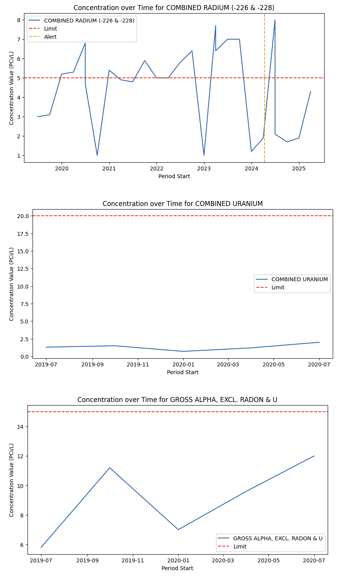
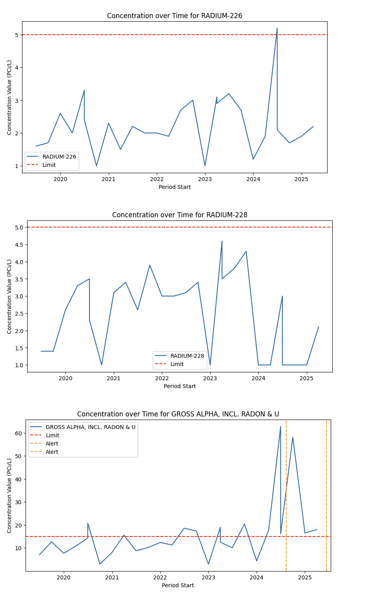

# Overview 

This repo contains a basic analysis and plotting of EPA-defined contaminants reported in a **REDACTED** water supply. Analyte plots for all historical data is included below, along with the EPA-defined threshold for reporting and presumed intervention. 

